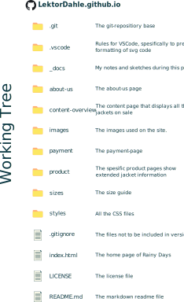

# LektorDahle.github.io

## Overview over the files

## Inspirations

MDN documentation has been used extensively throughout this project to understand and implement many of the features on this page. It is therefore not possible to distinguish which parts were created with help from MDN or to recall exactly when it was used.
[https://developer.mozilla.org/en-US/][(https://en.wikipedia.org/wiki/IPhone_(1st_generation)](https://developer.mozilla.org/en-US/)) 

**Book:** CSS in Depth by Keith J. Grant (ISBN:978-1-61729-345-0)

**Book:** UI/UX Design for Professionals by Sharanpreet Kaur (ISBN:978-93-481073-8-1)

**Webpage:** [https://www.w3schools.com/howto/howto_css_switch.asp](https://www.w3schools.com/howto/howto_css_switch.asp) (for the dark/light switch, hambruger menu and the payment page)

**Webpage:** [https://www.w3schools.com/css/css_combinators.asp](https://www.w3schools.com/css/css_combinators.asp) (for undestanding parts of css I have used many times before)

**Webpage:** [https://en.wikipedia.org/wiki/IPhone_(1st_generation)](https://en.wikipedia.org/wiki/IPhone_(1st_generation)) (Minimum screen size)

**Webpage:** [https://javascript.plainenglish.io/the-golden-rule-of-css-layouts-flexbox-or-grid-026e9fef08ed](https://javascript.plainenglish.io/the-golden-rule-of-css-layouts-flexbox-or-grid-026e9fef08ed) (When to use flexbox or css grid)

## The design-prototype on figma
URL to prototype
https://www.figma.com/design/LeNq2ENZmtea0SEthGu8CQ/RainyDays?node-id=0-1&t=kx0RLS5rqgvWUyCa-1

URL to desktop design file
https://www.figma.com/proto/LeNq2ENZmtea0SEthGu8CQ/RainyDays?node-id=0-1&t=kx0RLS5rqgvWUyCa-1

URL to phone design file
https://www.figma.com/proto/LeNq2ENZmtea0SEthGu8CQ/RainyDays?node-id=239-1152&t=kx0RLS5rqgvWUyCa-1
